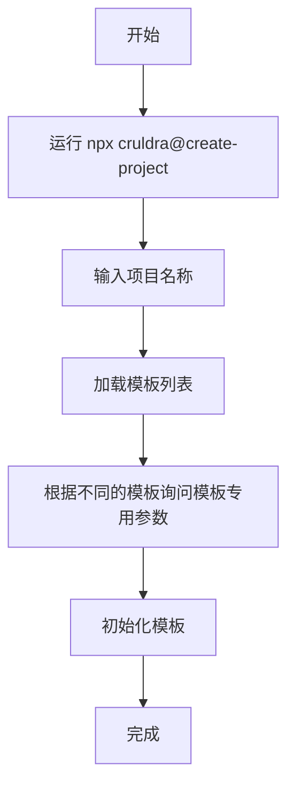

# 简介

快速生成不同类型的项目骨架

## 技术栈

- Node.js
- Pnpm
- TypeScript

## 流程


```mermaid
graph TD
    A[开始] --> B[运行 npx cruldra@create-project]
    B --> C[输入项目名称]
    C --> D[加载模板列表]
    D --> E[根据不同的模板询问模板专用参数]
    E --> F[初始化模板]
    F --> G[完成]
```

## 构建

```sh
pnpm run build
```
## 更新版本

```sh
npm version patch
```
## 发布

```sh
pnpm publish
```
## 测试

```sh
npx 